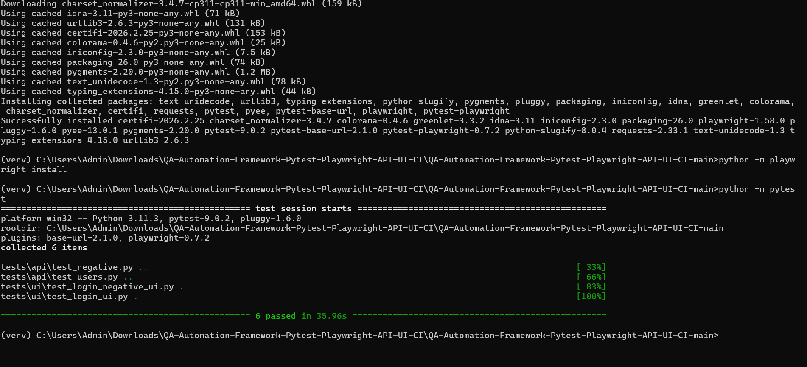
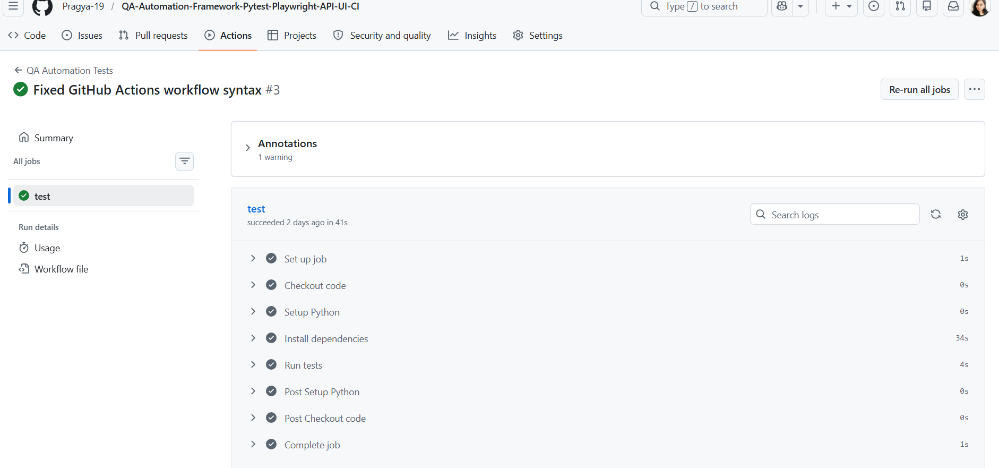

## 🔁 CI/CD Status

[[](https://github.com/Pragya-19/QA-Automation-Framework-Pytest-Playwright-API-UI-CI/actions/workflows/ci.yml)]

\# 🚀 **QA-Automation-Framework-Pytest-Playwright-API-UI-CI**

## Why this project matters

This project demonstrates a real-world QA Automation Framework for modern SDET workflows.

It covers:
- UI Automation using Playwright
- API Testing using Python
- Page Object Model (POM) design
- CI/CD execution using GitHub Actions

The goal is to validate quality across UI, API, and automation pipeline levels.


\## 📌** Project Overview**

This project demonstrates a scalable and modern QA automation framework integrating UI testing, API testing, and CI/CD workflows
It is designed to simulate real-world quality engineering practices used in modern product-based companies, focusing on automation, system thinking, and intelligent testing approaches.

## Application Under Test

This framework uses demo/sample applications to simulate real-world testing scenarios such as:

- Login validation
- Positive and negative test cases
- User-related API validations

This helps demonstrate practical automation design for QA and SDET roles.


\---


\## 🎯 Key Objectives

To build an **end-to-end quality engineering solution** that goes beyond UI testing and validates the complete system:

👉 UI → API → Data → CI/CD Pipeline

---

## 🛠️ Tech Stack

- Python
- Playwright (UI Automation)
- Pytest (Test Framework)
- Requests (API Testing)
- GitHub Actions (CI/CD)

---

## 📂 Project Structure


QA-Automation-Framework-Pytest-Playwright-API-UI-CI/
│

├── pages/ # Page Object Model classes

├── tests/

      │ ├── ui/ # UI test cases
      │ ├── api/ # API test cases
      
├── api_clients/ # API helper methods

├── utils/ # Utilities and helpers

├── screenshotss/ # proof of execution

├── conftest.py # Fixtures and setup


---

## ▶️ Running Tests

```bash
python -m pytest

🔁 CI/CD Execution (GitHub Actions)

This framework is integrated with GitHub Actions to automatically run tests on every push.

📊 Test Execution Results

## Execution Proof

### Local Test Run


### CI/CD Pipeline


### UI Execution


### Test Execution Video
[Watch Execution](screenshots/test-execution.webm)


🧪 Sample Test Scenarios
UI Test – Login Flow
Navigate to login page
Enter credentials
Validate successful login
Verify dashboard elements
API Test – User Validation
Send request to API endpoint
Validate response status
Verify response payload

## Test Coverage

The framework currently includes:

- Positive UI test scenarios
- Negative UI test scenarios
- API validation scenarios

The structure is designed to scale easily by adding more modules, pages, and test cases.


💡 Key Learnings

Built maintainable automation using POM
Integrated UI + API testing in one framework
Implemented CI/CD pipeline for automated execution
Understood real-world SDET workflow

## Example Test Files

- `tests/ui/test_login_ui.py`
- `tests/ui/test_login_negative_ui.py`
- `tests/api/test_users.py`
- `tests/api/test_negative.py`

## Future Enhancements

Planned improvements for this framework:

- HTML or Allure reporting
- Parallel test execution
- Better test data management
- Logging and failure screenshots

👩‍💻 Author

Pragya Kapil

Linkedin Profile : https://www.linkedin.com/in/pragya-kapil-qa/

QA Automation Engineer | SDET | Playwright | API Testing


