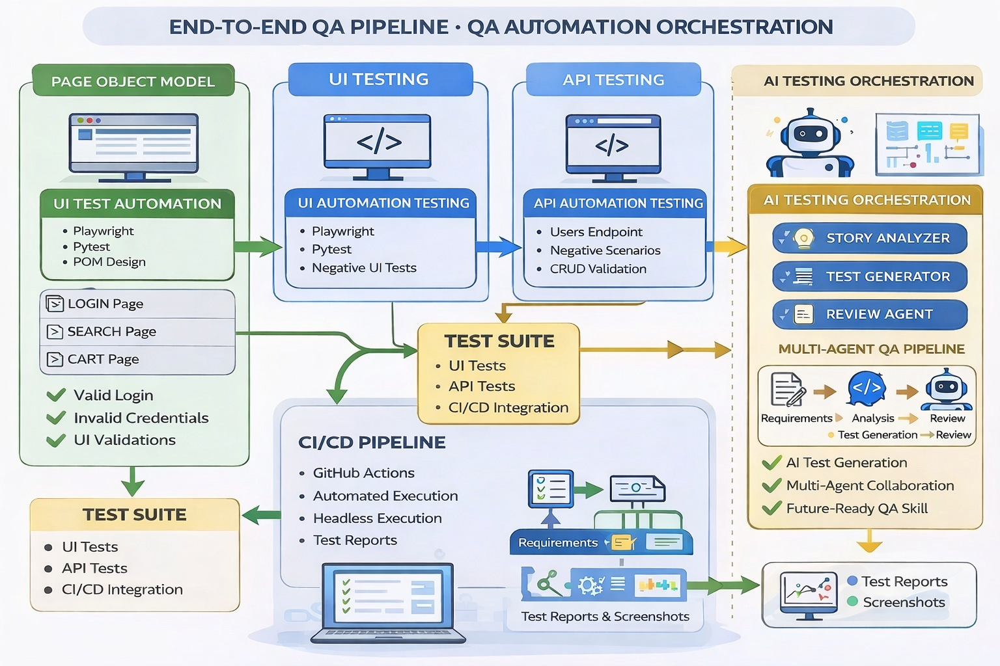

## 🔁 CI/CD Status

[]

🚀 QA Automation Framework with AI Testing & Orchestration

A production-style End-to-End QA Automation Framework built using Playwright + Pytest + API Testing + CI/CD, enhanced with AI-driven testing and a multi-agent AI orchestration pipeline.

This project demonstrates modern SDET practices + future-ready AI testing capabilities.

🔥 Key Features

✅ Automation Coverage
UI Automation using Playwright (Python)
API Testing using Requests + Pytest
Data-driven testing support
Positive, Negative & Edge case validation

✅ Framework Design
Page Object Model (POM)
Modular & scalable structure
Reusable utilities & configs

✅ CI/CD Integration
GitHub Actions workflow
Automated test execution on push
Headless browser execution

🤖 AI Testing Capabilities
AI-based test case generation
Prompt-driven testing approach
Structured QA outputs

🤖 AI Orchestration (Advanced)
Multi-agent testing pipeline
Requirement → Analysis → Test → Review
Simulates real QA workflow using AI agents

🧠 AI Testing Module
Generates structured test cases using prompt-based logic.

📌 Features
Positive test cases
Negative test cases
Edge case coverage
QA-friendly structured output

▶️ Run
python ai_testing/generate_test_cases.py

🤖 AI Orchestrator (Multi-Agent Pipeline)
Simulates how AI agents collaborate in a QA lifecycle.

🧩 Agents

1️⃣ Story Analyzer
Understands requirement
Identifies risks
Defines test focus

2️⃣ Test Generator
Generates test scenarios
Covers functional cases

3️⃣ Review Agent
Evaluates test coverage
Validates completeness

🔄 Workflow
Requirement → Story Analysis → Test Generation → Review → Final Output

▶️ Run
python ai_orchestrator/orchestrator.py

🧪 Test Coverage
UI Tests
Login functionality
Valid login
Invalid credentials
UI validation scenarios
API Tests
Users API validation
Negative API testing
Response validation
⚙️ Tech Stack
Python 3.11+
Pytest
Playwright
Requests
GitHub Actions
Pytest Plugins (base-url, playwright)

📊 CI/CD Pipeline
Runs on every push to main
Installs dependencies
Executes test suite
Generates results automatically

📁 Project Structure
QA-Automation-Framework/

│
├── ai_testing/              # AI test case generator

├── ai_orchestrator/        # Multi-agent AI pipeline

│
├── tests/
│   ├── ui/
│   ├── api/

│
├── pages/                  # Page Object Model

├── api_clients/            # API utilities

├── utils/                  # Config & helpers

│
├── screenshots/            # Failure screenshots

├── test-results/           # Execution outputs

│
├── .github/workflows/      # CI/CD pipeline

│
├── requirements.txt

└── README.md

# 🏗️ Architecture Diagram

This framework follows a modular, scalable architecture combining traditional QA automation with AI-driven testing components.

▶️ How to Run Locally

1️⃣ Clone repo
git clone <[(https://github.com/Pragya-19/QA-Automation-Framework-Pytest-Playwright-API-UI-CI)]>
cd QA-Automation-Framework

2️⃣ Create virtual environment
python -m venv venv
venv\Scripts\activate

3️⃣ Install dependencies
pip install -r requirements.txt
python -m playwright install

4️⃣ Run tests
pytest

📈 Sample Output (AI Testing)
Test Case ID: TC01  
Scenario: Valid login  
Steps: Enter valid credentials  
Expected Result: Login successful  

🚀 Future Enhancements
Integrate OpenAI API for real AI generation
Add Allure/HTML reporting
Parallel execution
Docker support
Test data management layer

👩‍💻 Author

Pragya Kapil

QA Automation Engineer | SDET | AI Testing Enthusiast

Linkedin :https://www.linkedin.com/in/pragya-kapil-qa
